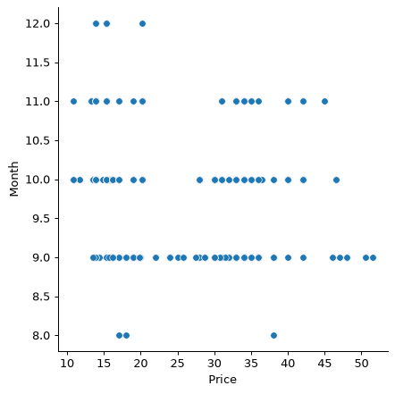
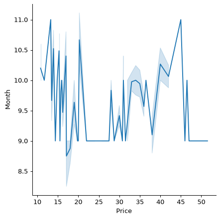
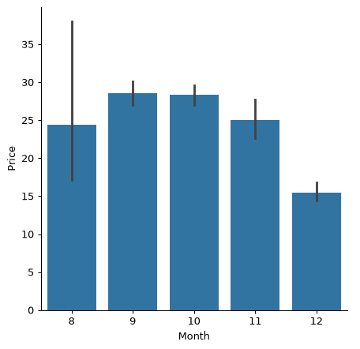
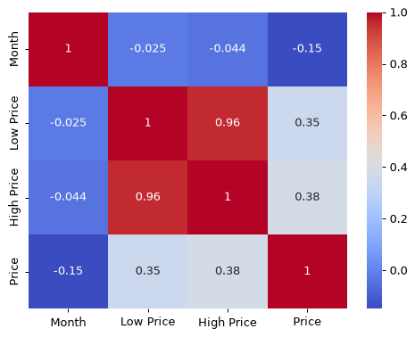

# Build a regression model using Scikit-learn: prepare and visualize data


Infographic by [Dasani Madipalli](https://twitter.com/dasani_decoded)

## [Pre-lecture quiz](https://ff-quizzes.netlify.app/en/ml/)

> ### [This lesson is available in R!](./solution/R/lesson_2.html)

## Introduction

Now that you are set up with the tools you need to start tackling machine learning model building with Scikit-learn, you are ready to start asking questions of your data. As you work with data and apply ML solutions, it's very important to understand how to ask the right question to properly unlock the potentials of your dataset.

In this lesson, you will learn:

- How to prepare your data for model-building.
- How to use Matplotlib for data visualization.
- How to use Seaborn for more expressive data visualization.

## Asking the right question of your data

The question you need answered will determine what type of ML algorithms you will leverage. And the quality of the answer you get back will be heavily dependent on the nature of your data.

Take a look at the [data](https://github.com/microsoft/ML-For-Beginners/blob/main/2-Regression/data/US-pumpkins.csv) provided for this lesson. You can open this .csv file in VS Code. A quick skim immediately shows that there are blanks and a mix of strings and numeric data. There's also a strange column called 'Package' where the data is a mix between 'sacks', 'bins' and other values. The data, in fact, is a bit of a mess.

[](https://youtu.be/5qGjczWTrDQ "ML for beginners - How to Analyze and Clean a Dataset")

> 🎥 Click the image above for a short video working through preparing the data for this lesson.

In fact, it is not very common to be gifted a dataset that is completely ready to use to create a ML model out of the box. In this lesson, you will learn how to prepare a raw dataset using standard Python libraries. You will also learn various techniques to visualize the data.

## Case study: 'the pumpkin market'

In this folder you will find a .csv file in the root `data` folder called [US-pumpkins.csv](https://github.com/microsoft/ML-For-Beginners/blob/main/2-Regression/data/US-pumpkins.csv) which includes 1757 lines of data about the market for pumpkins, sorted into groupings by city. This is raw data extracted from the [Specialty Crops Terminal Markets Standard Reports](https://www.marketnews.usda.gov/mnp/fv-report-config-step1?type=termPrice) distributed by the United States Department of Agriculture.

### Preparing data

This data is in the public domain. It can be downloaded in many separate files, per city, from the USDA web site. To avoid too many separate files, we have concatenated all the city data into one spreadsheet, thus we have already _prepared_ the data a bit. Next, let's take a closer look at the data.

### The pumpkin data - early conclusions

What do you notice about this data? You already saw that there is a mix of strings, numbers, blanks and strange values that you need to make sense of.

What question can you ask of this data, using a Regression technique? What about "Predict the price of a pumpkin for sale during a given month". Looking again at the data, there are some changes you need to make to create the data structure necessary for the task.
## Exercise - analyze the pumpkin data

Let's use [Pandas](https://pandas.pydata.org/), (the name stands for `Python Data Analysis`) a tool very useful for shaping data, to analyze and prepare this pumpkin data.

### First, check for missing dates

You will first need to take steps to check for missing dates:

1. Convert the dates to a month format (these are US dates, so the format is `MM/DD/YYYY`).
2. Extract the month to a new column.

Open the _notebook.ipynb_ file in Visual Studio Code and import the spreadsheet in to a new Pandas dataframe.

1. Use the `head()` function to view the first five rows.

    ```python
    import pandas as pd
    pumpkins = pd.read_csv('../data/US-pumpkins.csv')
    pumpkins.head()
    ```

    ✅ What function would you use to view the last five rows?

1. Check if there is missing data in the current dataframe:

    ```python
    pumpkins.isnull().sum()
    ```

    There is missing data, but maybe it won't matter for the task at hand.

1. To make your dataframe easier to work with, select only the columns you need, using the `loc` function which extracts from the original dataframe a group of rows (passed as first parameter) and columns (passed as second parameter). The expression `:` in the case below means "all rows".

    ```python
    columns_to_select = ['Package', 'Low Price', 'High Price', 'Date']
    pumpkins = pumpkins.loc[:, columns_to_select]
    ```

### Second, determine average price of pumpkin

Think about how to determine the average price of a pumpkin in a given month. What columns would you pick for this task? Hint: you'll need 3 columns.

Solution: take the average of the `Low Price` and `High Price` columns to populate the new Price column, and convert the Date column to only show the month. Fortunately, according to the check above, there is no missing data for dates or prices.

1. To calculate the average, add the following code:

    ```python
    price = (pumpkins['Low Price'] + pumpkins['High Price']) / 2

    month = pd.DatetimeIndex(pumpkins['Date']).month

    ```

   ✅ Feel free to print any data you'd like to check using `print(month)`.

2. Now, copy your converted data into a fresh Pandas dataframe:

    ```python
    new_pumpkins = pd.DataFrame({'Month': month, 'Package': pumpkins['Package'], 'Low Price': pumpkins['Low Price'],'High Price': pumpkins['High Price'], 'Price': price})
    ```

    Printing out your dataframe will show you a clean, tidy dataset on which you can build your new regression model.

### But wait! There's something odd here

If you look at the `Package` column, pumpkins are sold in many different configurations. Some are sold in '1 1/9 bushel' measures, and some in '1/2 bushel' measures, some per pumpkin, some per pound, and some in big boxes with varying widths.

> Pumpkins seem very hard to weigh consistently

Digging into the original data, it's interesting that anything with `Unit of Sale` equalling 'EACH' or 'PER BIN' also have the `Package` type per inch, per bin, or 'each'. Pumpkins seem to be very hard to weigh consistently, so let's filter them by selecting only pumpkins with the string 'bushel' in their `Package` column.

1. Add a filter at the top of the file, under the initial .csv import:

    ```python
    pumpkins = pumpkins[pumpkins['Package'].str.contains('bushel', case=True, regex=True)]
    ```

    If you print the data now, you can see that you are only getting the 415 or so rows of data containing pumpkins by the bushel.

### But wait! There's one more thing to do

Did you notice that the bushel amount varies per row? You need to normalize the pricing so that you show the pricing per bushel, so do some math to standardize it.

1. Add these lines after the block creating the new_pumpkins dataframe:

    ```python
    new_pumpkins.loc[new_pumpkins['Package'].str.contains('1 1/9'), 'Price'] = price/(1 + 1/9)

    new_pumpkins.loc[new_pumpkins['Package'].str.contains('1/2'), 'Price'] = price/(1/2)
    ```

✅ According to [The Spruce Eats](https://www.thespruceeats.com/how-much-is-a-bushel-1389308), a bushel's weight depends on the type of produce, as it's a volume measurement. "A bushel of tomatoes, for example, is supposed to weigh 56 pounds... Leaves and greens take up more space with less weight, so a bushel of spinach is only 20 pounds." It's all pretty complicated! Let's not bother with making a bushel-to-pound conversion, and instead price by the bushel. All this study of bushels of pumpkins, however, goes to show how very important it is to understand the nature of your data!

Now, you can analyze the pricing per unit based on their bushel measurement. If you print out the data one more time, you can see how it's standardized.

✅ Did you notice that pumpkins sold by the half-bushel are very expensive? Can you figure out why? Hint: little pumpkins are way pricier than big ones, probably because there are so many more of them per bushel, given the unused space taken by one big hollow pie pumpkin.

## Visualization Strategies

Part of the data scientist's role is to demonstrate the quality and nature of the data they are working with. To do this, they often create interesting visualizations, or plots, graphs, and charts, showing different aspects of data. In this way, they are able to visually show relationships and gaps that are otherwise hard to uncover.

[](https://youtu.be/SbUkxH6IJo0 "ML for beginners - How to Visualize Data with Matplotlib")

> 🎥 Click the image above for a short video working through visualizing the data for this lesson.

Visualizations can also help determine the machine learning technique most appropriate for the data. A scatterplot that seems to follow a line, for example, indicates that the data is a good candidate for a linear regression exercise.

One data visualization library that works well in Jupyter notebooks is [Matplotlib](https://matplotlib.org/) (which you also saw in the previous lesson).

> Get more experience with data visualization in [these tutorials](https://docs.microsoft.com/learn/modules/explore-analyze-data-with-python?WT.mc_id=academic-77952-leestott).

## Exercise - experiment with Matplotlib

Try to create some basic plots to display the new dataframe you just created. What would a basic line plot show?

1. Import Matplotlib at the top of the file, under the Pandas import:

    ```python
    import matplotlib.pyplot as plt
    ```

1. Rerun the entire notebook to refresh.
1. At the bottom of the notebook, add a cell to plot the data as a box:

    ```python
    price = new_pumpkins.Price
    month = new_pumpkins.Month
    plt.scatter(price, month)
    plt.show()
    ```

    

    Is this a useful plot? Does anything about it surprise you?

    It's not particularly useful as all it does is display in your data as a spread of points in a given month.

### Make it useful

To get charts to display useful data, you usually need to group the data somehow. Let's try creating a plot where the y axis shows the months and the data demonstrates the distribution of data.

1. Add a cell to create a grouped bar chart:

    ```python
    new_pumpkins.groupby(['Month'])['Price'].mean().plot(kind='bar')
    plt.ylabel("Pumpkin Price")
    ```

    

    This is a more useful data visualization! It seems to indicate that the highest price for pumpkins occurs in September and October. Does that meet your expectation? Why or why not?

## Exercise - experiment with Seaborn

Matplotlib is powerful, but it can take a lot of code to produce a polished chart. [Seaborn](https://seaborn.pydata.org/) is a library built _on top of_ Matplotlib that is designed for statistical data visualization. It works directly with Pandas dataframes, applies attractive default styles, and lets you create informative plots with far less code. Because Seaborn returns Matplotlib objects, you can still use everything you already know about Matplotlib to fine-tune the result.

> Seaborn is already included if you installed the packages in the previous lesson. If not, install it with `pip install seaborn`.

1. Import Seaborn at the top of the notebook, under the other imports. It is conventionally imported as `sns`:

    ```python
    import seaborn as sns
    ```

### Scatter plots to show relationships

A big part of exploring data before building a model is looking for _relationships_ between variables. A [scatter plot](https://en.wikipedia.org/wiki/Scatter_plot) is one of the best tools for this: if the points seem to follow a line, the two variables may be correlated, which is a good sign that a linear regression model could work.

1. Recreate the price-to-month scatter plot from before, this time using Seaborn's [`relplot()`](https://seaborn.pydata.org/generated/seaborn.relplot.html) (relational plot), which works directly with your dataframe columns:

    ```python
    sns.relplot(x="Price", y="Month", data=new_pumpkins)
    ```

    

    Notice how you pass the _column names_ and the dataframe, and Seaborn takes care of the axis labels for you.

2. You can switch to a line plot by passing `kind="line"`. Seaborn even draws a shaded band showing the confidence interval around the line:

    ```python
    sns.relplot(x="Price", y="Month", kind="line", data=new_pumpkins)
    ```

    

    This particular data is quite noisy, so a line plot isn't the clearest choice here — but it shows how easily you can change chart types in Seaborn.

### Bar charts to show distributions

Earlier you grouped the data by hand to create a bar chart with Matplotlib. Seaborn's [`catplot()`](https://seaborn.pydata.org/generated/seaborn.catplot.html) (categorical plot) can do the grouping and aggregation for you. By default `kind="bar"` shows the mean of each category along with a black line indicating the confidence interval.

1. Create a bar chart of average price per month:

    ```python
    sns.catplot(x="Month", y="Price", data=new_pumpkins, kind="bar")
    ```

    

    This confirms what you saw with Matplotlib — prices peak around September and October — but Seaborn also visualizes how much the price _varies_ within each month.

### Heatmaps to show correlations

Scatter plots compare two variables at a time. When you have several numeric columns, a [heatmap](https://en.wikipedia.org/wiki/Heat_map) lets you view the strength of the relationship between _every_ pair of columns at once. This is a common way to spot which features are most correlated before choosing what to feed into a model (and the same kind of chart is later used to display confusion matrices in classification).

1. Build a correlation matrix with Pandas, then draw it with Seaborn's [`heatmap()`](https://seaborn.pydata.org/generated/seaborn.heatmap.html). The `annot=True` option prints the correlation values on each cell:

    ```python
    correlations = new_pumpkins[['Month', 'Low Price', 'High Price', 'Price']].corr()
    sns.heatmap(correlations, annot=True, cmap="coolwarm")
    ```

    

    Values close to `1` (or `-1`) mean the columns are strongly correlated. Notice how `Low Price` and `High Price` are almost perfectly correlated, while `Month` has very little correlation with price. ✅ What does that tell you about which columns are useful for predicting price?

### Matplotlib or Seaborn?

Both libraries are worth knowing:

- **Matplotlib** gives you fine-grained control over every element of a chart and is the foundation almost every other Python plotting library builds on.
- **Seaborn** provides higher-level functions and attractive defaults for statistical charts, works directly with dataframes, and is often quicker for exploratory data analysis.

A common workflow is to reach for Seaborn to explore your data quickly, then drop down to Matplotlib when you need to customize the details.

---

## 🚀Challenge

Explore the different types of visualization that Matplotlib and Seaborn offer. Which types are most appropriate for regression problems?

## [Post-lecture quiz](https://ff-quizzes.netlify.app/en/ml/)

## Review & Self Study

Take a look at the many ways to visualize data. Make a list of the various libraries available and note which are best for given types of tasks, for example 2D visualizations vs. 3D visualizations. What do you discover?

## Assignment

[Exploring visualization](assignment.md)
